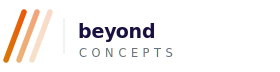
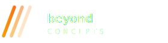
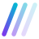

# Beyond Concepts — Brand Assets

Official brand assets for [Beyond Concepts](https://beyondconcepts.com.au) — web design & development studio.

## Logo Files

| File | Usage |
|---|---|
| `logo.svg` | Full horizontal logo — light backgrounds |
| `logo-dark.svg` | Full horizontal logo — dark backgrounds |
| `icon.svg` | Icon mark only — favicons, avatars, small applications |

## The Mark

The **`///` triple slash** mark represents going *beyond* — forward momentum,
breaking through boundaries, always further. The gradient runs from
violet `#7C3AED` to cyan `#06B6D4`, fading through three strokes to
suggest depth and direction.

## Colours

| Name | Hex | Usage |
|---|---|---|
| Violet | `#7C3AED` | Gradient start |
| Cyan | `#06B6D4` | Gradient end |
| Dark | `#1A1040` | Wordmark on light bg |
| White | `#FFFFFF` | Wordmark on dark bg |

## Usage

```html
<!-- Light background -->


<!-- Dark background -->


<!-- Icon only (favicon, avatar) -->

```

## Contact

[beyondconcepts.com.au](https://beyondconcepts.com.au) · beyondconcepts.26@gmail.com
